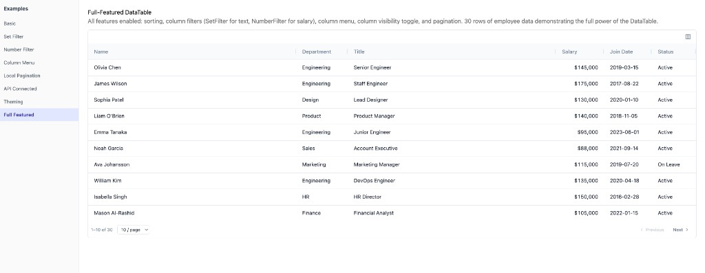

# @sandylib27/react-ag-datatable

[](https://www.npmjs.com/package/@sandylib27/react-ag-datatable)
[](./LICENSE)

A production-ready React DataTable built on **AG Grid Community** that ships enterprise-grade features out of the box — searchable set filters, numeric filters, column header menus, integrated pagination, server-side data sourcing, and a classical theme with dark mode.

Built with [Radix UI](https://www.radix-ui.com/) primitives (shadcn-style) and [Tailwind CSS](https://tailwindcss.com/).



**[Watch the demo on YouTube](https://youtu.be/Po9rvM1-OUc)**

## Features

- **Searchable Set Filter** — Checkbox list filter with search input, Select All, and a scrollable value list
- **Number Filter** — Operator dropdown with Equals, Not equal, Greater than, Less than, Between, Blank, and more
- **Column Header Menu** — Sort, pin, autosize, filter access, column chooser, and reset — all from the header
- **Integrated Pagination** — Works with both local data and API mode; filter-aware page counts
- **API Mode (DataSource)** — Pass an async function, and the table handles loading, error, and empty states
- **CSV / Excel Export** — One-click download as CSV or Excel with an Export button; respects visible columns and active filters
- **Loading / Error / Empty Overlays** — Built-in skeleton loader, error with retry, and empty state — all overridable
- **Classical Theme** — CSS-variable-based theme (`--cdt-*` prefix) with dark mode support
- **Two Modes** — Local mode with client-side filtering/sorting, or API mode with server-side queries
- **TypeScript First** — Full generic type support (`DataTable<TData>`) and exported utility types

## Installation

```bash
npm install @sandylib27/react-ag-datatable ag-grid-community ag-grid-react
```

### Peer Dependencies

| Package              | Version   |
|----------------------|-----------|
| `react`              | `>=18`    |
| `react-dom`          | `>=18`    |
| `ag-grid-community`  | `>=35`    |
| `ag-grid-react`      | `>=35`    |

### CSS

Import the stylesheet once in your app entry point:

```ts
import '@sandylib27/react-ag-datatable/styles.css';
```

> **Note:** AG Grid v35+ uses the Theming API. You do **not** need to import `ag-grid.css` or `ag-theme-quartz.css` — the theme is applied programmatically via `themeQuartz.withParams()` inside the component.

## Quick Start

```tsx
import { DataTable } from '@sandylib27/react-ag-datatable';
import '@sandylib27/react-ag-datatable/styles.css';

const users = [
  { id: 1, name: 'Alice', email: 'alice@example.com', age: 28 },
  { id: 2, name: 'Bob',   email: 'bob@example.com',   age: 34 },
  { id: 3, name: 'Carol', email: 'carol@example.com',  age: 42 },
];

const columns = [
  { field: 'name', headerName: 'Name' },
  { field: 'email', headerName: 'Email' },
  { field: 'age', headerName: 'Age', type: 'numericColumn' },
];

export function UsersTable() {
  return (
    <DataTable
      data={users}
      columns={columns}
      bordered
      hoverable
      enableSorting
      enableColumnFilter
      pagination
    />
  );
}
```

## API Mode

Pass a `dataSource` function instead of `data`. The component builds a `DataTableQuery` object and calls your function whenever the page, sort, or filters change.

```tsx
import { DataTable, type DataTableQuery, type DataTableResponse } from '@sandylib27/react-ag-datatable';

interface User {
  id: number;
  name: string;
  email: string;
  role: string;
}

async function fetchUsers(query: DataTableQuery): Promise<DataTableResponse<User>> {
  const params = new URLSearchParams({
    page: String(query.page),
    pageSize: String(query.pageSize),
    ...(query.sort ? { sortField: query.sort.field, sortDir: query.sort.direction } : {}),
  });

  const res = await fetch(`/api/users?${params}`);
  return res.json(); // { rows: User[], totalRows: number }
}

export function UsersTable() {
  return (
    <DataTable<User>
      dataSource={fetchUsers}
      columns={[
        { field: 'name', headerName: 'Name' },
        { field: 'email', headerName: 'Email' },
        { field: 'role', headerName: 'Role' },
      ]}
      bordered
      hoverable
      enableSorting
      enableColumnFilter
      enableColumnMenu
      pagination={{ pageSize: 25, pageSizeOptions: [25, 50, 100] }}
    />
  );
}
```

The `DataTableQuery` sent to your function looks like:

```ts
{
  page: 0,
  pageSize: 25,
  sort: { field: 'name', direction: 'asc' } | null,
  filters: {
    role: { type: 'set', values: ['Admin', 'Editor'] },
    age:  { type: 'number', operator: 'greaterThan', value: 18 },
  }
}
```

## Features Guide

### Searchable Set Filter

Enabled by default on text columns when `enableColumnFilter` is set. Renders a popover with a search input, Select All toggle, and a scrollable checkbox list of unique values.

```tsx
<DataTable data={data} columns={columns} enableColumnFilter />
```

### Number Filter

Automatically applied to columns with `type: 'numericColumn'`. Provides an operator dropdown and value input(s).

```tsx
const columns = [
  { field: 'price', headerName: 'Price', type: 'numericColumn' },
];
```

Available operators: `equals`, `notEqual`, `greaterThan`, `greaterThanOrEqual`, `lessThan`, `lessThanOrEqual`, `between`, `blank`, `notBlank`.

### Column Header Menu

A dropdown menu on each column header with sort controls, pinning options, autosize, filter access, and column visibility.

```tsx
<DataTable
  data={data}
  columns={columns}
  enableColumnMenu
  enableSorting
  enableColumnFilter
/>
```

Menu actions:
- Sort Ascending / Descending / Clear Sort
- Pin Left / Pin Right / Unpin
- Autosize This Column / Autosize All Columns
- Open Filter
- Choose Columns
- Reset Columns

### Column Visibility

A standalone panel that lets users toggle column visibility.

```tsx
<DataTable data={data} columns={columns} enableColumnVisibility />
```

### Row Reordering

Drag-to-reorder rows. The reordered dataset is emitted via `onRowReorder`.

```tsx
<DataTable
  data={items}
  columns={columns}
  enableRowReorder
  onRowReorder={(reorderedItems) => setItems(reorderedItems)}
/>
```

### Pagination

Enable with a boolean for defaults, or pass a config object.

```tsx
// Default: pageSize 15, options [15, 25, 50, 100]
<DataTable data={data} columns={columns} pagination />

// Custom
<DataTable
  data={data}
  columns={columns}
  pagination={{ pageSize: 25, pageSizeOptions: [25, 50, 100] }}
/>

// Shorthand props
<DataTable data={data} columns={columns} pagination pageSize={50} />
```

### CSV / Excel Export

Enable a toolbar Export button that downloads the visible, filtered data as CSV or Excel.

```tsx
<DataTable
  data={data}
  columns={columns}
  enableExport
  exportFileName="products"
/>
```

The export respects:
- **Visible columns** — hidden columns are excluded
- **Active filters** — only filtered rows are exported
- **Value formatters** — formatted values (e.g. `$1,234`) are used in the output

You can also call the export functions directly for custom triggers:

```tsx
import { exportToCSV, exportToExcel } from '@sandylib27/react-ag-datatable';

// With a GridApi reference
exportToCSV(gridApi, { fileName: 'report.csv' });
exportToExcel(gridApi, { fileName: 'report.xlsx' });
```

### Custom Overlays

Override the built-in loading, error, and empty state overlays.

```tsx
<DataTable
  dataSource={fetchData}
  columns={columns}
  loadingOverlay={<MyLoadingSpinner />}
  errorOverlay={(error, retry) => (
    <div>
      <p>Something went wrong: {error.message}</p>
      <button onClick={retry}>Retry</button>
    </div>
  )}
  emptyOverlay={<p>No records found.</p>}
/>
```

### Row Click & Row Styling

```tsx
<DataTable
  data={data}
  columns={columns}
  hoverable
  onRowClick={(row) => navigate(`/users/${row.id}`)}
  rowClassName={(row) => (row.isArchived ? 'opacity-50' : undefined)}
/>
```

### Pinned Top Rows

Rows pinned to the top are always visible and unaffected by sort or filter.

```tsx
<DataTable
  data={data}
  columns={columns}
  pinnedTopRows={[{ id: 'total', name: 'Total', amount: 1250 }]}
/>
```

### External Row Filter

Control which rows participate in filtering. Rows that fail the predicate are always displayed.

```tsx
<DataTable
  data={data}
  columns={columns}
  enableColumnFilter
  isRowFilterable={(row) => !row.isPinned}
/>
```

## Theming

The component uses CSS variables with a `--cdt-` prefix. Override them on any ancestor to customize the look.

```css
/* Light theme (default) */
[data-cdt-datatable] {
  --cdt-background: 0 0% 100%;
  --cdt-foreground: 222.2 84% 4.9%;
  --cdt-muted: 210 40% 96.1%;
  --cdt-muted-foreground: 215.4 16.3% 46.9%;
  --cdt-border: 214.3 31.8% 91.4%;
  --cdt-ring: 222.2 84% 4.9%;
  --cdt-primary: 222.2 47.4% 11.2%;
  --cdt-primary-foreground: 210 40% 98%;
  --cdt-destructive: 0 84.2% 60.2%;
  --cdt-hover: 210 40% 96.1%;
  --cdt-header-bg: 210 40% 98%;
  --cdt-row-hover: 210 40% 96.1%;
  --cdt-row-selected: 214.3 31.8% 91.4%;
  --cdt-skeleton: 210 40% 93%;
  --cdt-radius: 0.5rem;
  --cdt-shadow: 0 1px 3px 0 rgb(0 0 0 / 0.1);
}

/* Dark mode */
.dark [data-cdt-datatable],
[data-cdt-datatable].dark {
  --cdt-background: 222.2 84% 4.9%;
  --cdt-foreground: 210 40% 98%;
  --cdt-muted: 217.2 32.6% 17.5%;
  --cdt-muted-foreground: 215 20.2% 65.1%;
  --cdt-border: 217.2 32.6% 17.5%;
  --cdt-header-bg: 222.2 47.4% 8.2%;
  --cdt-row-hover: 217.2 32.6% 12%;
  --cdt-row-selected: 217.2 32.6% 17.5%;
  --cdt-skeleton: 217.2 32.6% 14%;
}
```

CSS variable values use the HSL channel format (`H S% L%` without the `hsl()` wrapper) so they work with Tailwind's opacity modifier syntax.

## Running Examples Locally

The repo includes 8 interactive examples you can run in a browser during development:

```bash
git clone https://github.com/sandylib27/react-ag-datatable.git
cd react-ag-datatable
npm install
npm run dev:examples
```

Opens at `http://localhost:5173` with a sidebar listing all examples:

| Example | What it shows |
|---------|---------------|
| **Basic** | Minimal table with sorting and row click |
| **Set Filter** | Searchable checkbox filter on text columns |
| **Number Filter** | Operator dropdown filter on numeric columns |
| **Column Menu** | Header menu with sort, pin, autosize, column chooser |
| **Local Pagination** | Client-side pagination with page size selector |
| **API Connected** | Server-side data fetching with loading/error states |
| **Export** | CSV and Excel download with filtered data |
| **Theming** | CSS variable overrides and dark mode toggle |
| **Full Featured** | All features combined in a single table |

The example app resolves imports to the local `src/` so changes are reflected instantly via Vite HMR. It is not included in the published package.

## API Reference

### `<DataTable<TData>>`

| Prop | Type | Default | Description |
|------|------|---------|-------------|
| `data` | `TData[]` | — | Row data for local mode. Mutually exclusive with `dataSource`. |
| `dataSource` | `DataTableDataSource<TData>` | — | Async data fetcher for API mode. Mutually exclusive with `data`. |
| `columns` | `ColDef<TData>[]` | — | AG Grid column definitions. **Required.** |
| `size` | `'sm' \| 'md'` | `'md'` | Row density. `'sm'` = 36 px rows, `'md'` = 44 px rows. |
| `bordered` | `boolean` | `false` | Show outer border and rounded corners. |
| `hoverable` | `boolean` | `false` | Highlight rows on hover. |
| `enableSorting` | `boolean` | `false` | Enable click-to-sort on column headers. |
| `enableColumnFilter` | `boolean` | `false` | Enable column filter panels (SetFilter for text, NumberFilter for numeric). |
| `enableColumnMenu` | `boolean` | `false` | Enable the column header dropdown menu. |
| `enableColumnReorder` | `boolean` | `false` | Enable drag-to-reorder columns. |
| `enableRowReorder` | `boolean` | `false` | Enable drag-to-reorder rows. |
| `enableColumnVisibility` | `boolean` | `false` | Show the column visibility toggle panel. |
| `enableExport` | `boolean` | `false` | Show the CSV/Excel export button in the toolbar. |
| `exportFileName` | `string` | `'export'` | File name for exports (without extension). |
| `pagination` | `boolean \| PaginationConfig` | `false` | Enable pagination. Pass `true` for defaults or a config object. |
| `pageSize` | `number` | `15` | Default page size. Shorthand for `pagination={{ pageSize }}`. |
| `pageSizeOptions` | `number[]` | `[15, 25, 50, 100]` | Available page sizes in the dropdown. |
| `onRowReorder` | `(data: TData[]) => void` | — | Callback with the reordered dataset after a row drag. |
| `rowIdAccessor` | `keyof TData & string` | `'id'` | Property key used as the unique row identifier. |
| `isRowFilterable` | `(row: TData) => boolean` | — | Predicate to exclude rows from column filtering. |
| `onRowClick` | `(row: TData) => void` | — | Callback when a body row is clicked. |
| `rowClassName` | `(row: TData) => string \| undefined` | — | Return additional CSS class names per row. |
| `pinnedTopRows` | `TData[]` | — | Rows pinned to the top, unaffected by sort/filter. |
| `loadingOverlay` | `ReactNode` | Built-in skeleton | Custom loading overlay. |
| `errorOverlay` | `(error: Error, retry: () => void) => ReactNode` | Built-in error | Custom error overlay. Receives the error and a retry callback. |
| `emptyOverlay` | `ReactNode` | Built-in empty | Custom empty state overlay. |
| `className` | `string` | — | Additional CSS class on the wrapper element. |

## Types Reference

All types are exported from the package entry point.

```ts
import type {
  // Component props
  DataTableProps,

  // API mode
  DataTableDataSource,
  DataTableQuery,
  DataTableResponse,
  DataTableSortModel,

  // Pagination
  PaginationConfig,

  // Filters
  DataTableFilterModel,
  SetFilterModel,
  NumberFilterModel,
  NumberFilterOperator,

  // Export
  ExportOptions,

  // Re-exported from AG Grid
  ColDef,
  GridApi,
  ICellRendererParams,
  ValueGetterParams,
} from '@sandylib27/react-ag-datatable';
```

### Key Types

```ts
interface DataTableQuery {
  page: number;
  pageSize: number;
  sort: DataTableSortModel | null;
  filters: Record<string, DataTableFilterModel>;
}

interface DataTableSortModel {
  field: string;
  direction: 'asc' | 'desc';
}

interface DataTableResponse<TData> {
  rows: TData[];
  totalRows: number;
}

type DataTableDataSource<TData> = (query: DataTableQuery) => Promise<DataTableResponse<TData>>;

interface PaginationConfig {
  pageSize?: number;
  pageSizeOptions?: number[];
}

// Filter models
interface SetFilterModel {
  type: 'set';
  values: string[];
}

interface NumberFilterModel {
  type: 'number';
  operator: NumberFilterOperator;
  value?: number;
  valueTo?: number; // used with 'between' operator
}

type NumberFilterOperator =
  | 'equals'
  | 'notEqual'
  | 'greaterThan'
  | 'greaterThanOrEqual'
  | 'lessThan'
  | 'lessThanOrEqual'
  | 'between'
  | 'blank'
  | 'notBlank';

type DataTableFilterModel = SetFilterModel | NumberFilterModel;
```

## Tech Stack

| Layer | Technology |
|-------|------------|
| Grid engine | [AG Grid Community](https://www.ag-grid.com/) v35+ |
| UI primitives | [Radix UI](https://www.radix-ui.com/) (bundled, no install needed) |
| Icons | [Lucide React](https://lucide.dev/) |
| Styling | [Tailwind CSS](https://tailwindcss.com/) + CSS variables |
| Bundler | [tsup](https://tsup.egoist.dev/) (ESM + CJS + DTS) |
| Dev server | [Vite](https://vite.dev/) (examples only, not published) |

## Contributing

Contributions are welcome! Please open an issue or submit a pull request.

```bash
git clone https://github.com/sandylib27/react-ag-datatable.git
cd react-ag-datatable
npm install
npm run dev:examples   # run examples in browser
npm run build          # build the library
npm run type-check     # verify types
```

## License

[MIT](./LICENSE)
